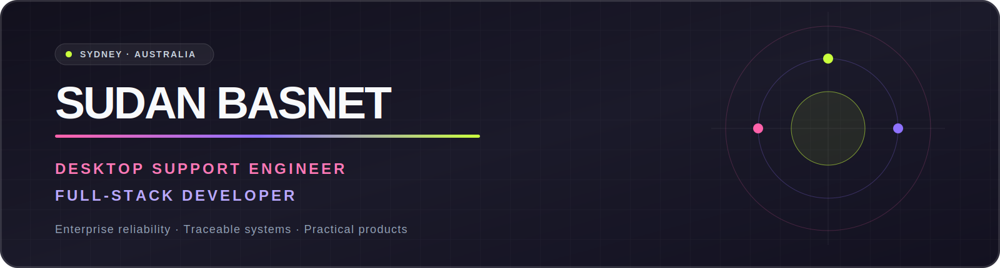
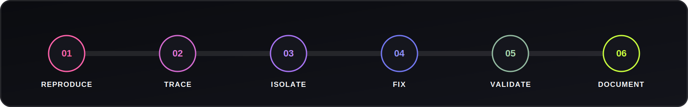

<!-- GitHub profile README for github.com/SudanBasnet -->

  

  
  
  
  

  <a href="#professional-experience">Experience</a> ·
  <a href="#technical-toolkit">Technology</a> ·
  <a href="#selected-full-stack-work">Projects</a> ·
  <a href="#github-signal">GitHub</a> ·
  <a href="#lets-connect">Connect</a>

<table>
  <tr>
    <td width="52%" valign="top">
      <h3>Enterprise reliability</h3>
      
3+ years supporting people, endpoints, identities, collaboration platforms, meeting spaces, service operations, and business continuity across global enterprise environments.

    </td>
    <td width="48%" valign="top">
      <h3>Full-stack product building</h3>
      
React, Next.js, TypeScript, Node.js, Express, MongoDB, authentication, API design, seeded data, deployment, motion, and Three.js—built as functioning products rather than static mockups.

    </td>
  </tr>
</table>

## The short version

I'm a Sydney-based IT professional with **3+ years of hands-on support experience** and a growing portfolio of production-oriented full-stack applications.

Professionally, I support people, endpoints, identities, collaboration tools, meeting spaces, service operations, and business continuity across enterprise environments. Outside that work, I design and build complete web products using React, Next.js, TypeScript, Node.js, Express, MongoDB, REST APIs, authentication, cloud media, modern UI systems, and 3D web experiences.

That combination shapes how I work: I care about the user-facing experience, but I also trace the full path behind it—from an interface action to the API, authentication layer, business logic, datastore, deployment environment, and final response.

  

## Professional experience

### Desktop Support Engineer · Total IT Global

**Enterprise Contractor · Sydney · 2025–Present**

- Deliver multi-client desktop and field support across globally recognised organisations.
- Handle endpoint provisioning, operating-system deployment, IMACD, secure decommissioning, hardware refreshes, and device lifecycle workflows.
- Support Microsoft 365, Microsoft Entra ID/Azure AD, Active Directory, Intune, Autopilot, VPN, printers, AV, Teams Rooms, and conferencing systems.
- Work within ServiceNow and ITSM processes, meeting SLA expectations while maintaining clear documentation and escalating effectively to specialist teams.
- Support onboarding, offboarding, access, asset, meeting-room, and business-continuity requirements in fast-moving enterprise environments.

### IT Support Specialist · Cloud Stream

**Sydney · 2023–2025**

- Managed incidents and service requests through prioritisation, ownership, SLA tracking, communication, and resolution.
- Supported hardware, software, networks, backups, file recovery, access, and system monitoring.
- Administered Active Directory, Group Policy, permissions, Intune deployments, and standard operating environment compliance.
- Assisted with infrastructure upgrades and the integration of new systems into existing environments.

### Enterprise environments supported

Through contractor and on-site support engagements, I have worked across environments including:

| Organisation | Environment / focus |
|---|---|
| **JLL** | Enterprise workplace and end-user technology support |
| **CHEP / Brambles** | Global supply chain; endpoint lifecycle, Autopilot, Intune, VPN, ServiceNow, server moves, and documentation |
| **DIAGEO** | Windows 10/11, Microsoft 365, mailboxes, Teams, SharePoint, peripherals, and Active Directory access |
| **Corteva Agriscience** | Enterprise hardware, Microsoft 365, VPN, peripherals, knowledge transfer, and continuity documentation |
| **PERRIGO** | Level 1/2 support, IMACD, onboarding/offboarding, MFA, Azure AD, Intune, and escalation coordination |
| **AMD** | Engineering and corporate endpoints, OS deployment, Autopilot, Intune, AV, Teams Rooms, and asset records |
| **Thomson Reuters** | Break/fix, hardware moves, ServiceNow, Exchange Online, Teams, OneDrive, printers, and continuity support |

## Technical toolkit

  

### Enterprise IT and service operations

**Also:** endpoint provisioning · IMACD · MFA · Group Policy · VPN · Exchange Online · SharePoint · OneDrive · Teams · printers · AV and meeting rooms · asset lifecycle · CMDB awareness · SLA management · escalation · knowledge documentation

### Frontend development

**UI and motion:** responsive design · Framer Motion · React Three Fiber · DaisyUI · React Bootstrap · accessible loading/error states · reduced-motion support · reusable design systems

### Backend, data, and integration

**Backend work:** authentication and authorisation · password hashing · refresh-token flows · role-aware APIs · validation · pagination and filtering · multipart uploads · email workflows · analytics · owner-scoped data · seed scripts · error handling · integration testing

### Delivery and developer tools

**Workflow:** Git and GitHub · REST Client/Postman-style API testing · ESLint · production builds · environment configuration · CORS debugging · deployment diagnostics · seed data · request-path tracing

## Selected full-stack work

<table>
  <tr>
    <td align="center"><strong>NEXUS</strong> Experiment platform</td>
    <td align="center"><strong>LMS</strong> Library operations</td>
    <td align="center"><strong>Broadway</strong> Real-data commerce</td>
    <td align="center"><strong>ClearQueue</strong> ITSM workflows</td>
    <td align="center"><strong>Finance</strong> Transaction insights</td>
  </tr>
  <tr>
    <td align="center"><code>React + Three.js</code></td>
    <td align="center"><code>MERN + Redux</code></td>
    <td align="center"><code>Next.js + TS</code></td>
    <td align="center"><code>React + Express</code></td>
    <td align="center"><code>MERN + Charts</code></td>
  </tr>
</table>

### NEXUS · Experiment Platform

A cinematic experimentation platform with authenticated workspaces, repeatable seeded data, experiment lifecycle management, portfolio analytics, activity history, server-side filtering, custom animation, and a scroll-driven Three.js story.

**Stack:** React · Tailwind CSS · Three.js · Framer Motion · Express · signed authentication · Node test runner

[Frontend](https://github.com/SudanBasnet/Experiment-Frontend) · [Backend](https://github.com/SudanBasnet/Experiment-Backend)

### Library Management System

A deployed MERN platform with catalogue search, borrowing and returns, reviews, member workflows, admin inventory management, JWT renewal, multipart book management, and Google authentication.

**Stack:** React 19 · Redux Toolkit · Express 5 · MongoDB

[Frontend](https://github.com/SudanBasnet/Frontend-LMS) · [Backend](https://github.com/SudanBasnet/Backend-LMS) · [Live app](https://frontend-lms-7220.onrender.com/)

### Broadway Store

A real-data ecommerce application with authentication, catalogue, cart, wishlist, role-aware administration, Cloudinary media, editorial content, responsive themes, and production deployment configuration.

**Stack:** Next.js 16 · TypeScript · Express 5 · MongoDB

[Frontend](https://github.com/SudanBasnet/Project-Ecom-TS-Frontend) · [Backend](https://github.com/SudanBasnet/Project-Ecom-TS) · [Live store](https://project-ecom-ts-frontend.onrender.com/)

### ClearQueue · ITSM Ticketing System

A production-oriented service-management platform with role-aware dashboards, incident ownership, SLA tracking, work notes, service requests, problems, changes, CMDB concepts, knowledge workflows, uploads, and seeded demo data.

**Stack:** React 19 · TypeScript · Express 5 · MongoDB · Cloudinary

[Frontend](https://github.com/SudanBasnet/Ticketing-System-Frontend) · [Backend](https://github.com/SudanBasnet/Ticketing-System-Backend) · [Live app](https://ticketing-system-frontend-eta.vercel.app/)

### Finance Tracker

An authenticated finance application with protected routes, transaction CRUD, search, pagination, charts, responsive feedback, and dashboard reporting.

**Stack:** MongoDB · Express · React · Recharts · Bootstrap

[Frontend](https://github.com/SudanBasnet/FT-Client) · [Backend](https://github.com/SudanBasnet/FT-API) · [Live demo](https://ft-client-six-delta.vercel.app/)

## GitHub signal

  

<table>
  <tr>
    <td width="50%">
      
    </td>
    <td width="50%">
      
    </td>
  </tr>
</table>

  

  

## What I care about when I build

- **Real functionality:** APIs, authentication, persistence, validation, permissions, and honest empty states—not static dashboard theatre.
- **Traceable systems:** understanding the complete path from a user action through the client, network, middleware, controller, datastore, and returned UI state.
- **Reliable UX:** visible loading feedback, backend-driven errors, protected actions, responsive layouts, and accessible motion.
- **Operational thinking:** logs, reproducible seed data, environment configuration, deployment checks, documentation, and safe change management.
- **Continuous improvement:** learning from support patterns and turning repeated problems into clearer processes or better software.

## Education and professional development

- **Master of Information Technology**
- **Microsoft 365 Fundamentals (MS-900)** — in progress
- **Microsoft Azure Fundamentals (AZ-900)** — in progress
- **Australian Computer Society member**
- **Full Australian work rights**

## Beyond the repositories

When I'm not resolving enterprise support issues or building an application, I am usually learning how systems fail, improving my deployment and debugging workflow, experimenting with motion and Three.js, or refining documentation so the next person can solve the same problem faster.

> Support taught me that reliability is experienced by people. Development taught me that reliability must be designed into the system.

## Let's connect

- Portfolio: [sudanbasnet.com](https://www.sudanbasnet.com/)
- Immersive portfolio: [sudanbasnet.com/immersive](https://www.sudanbasnet.com/immersive/)
- LinkedIn: [linkedin.com/in/sudan-basnet](https://www.linkedin.com/in/sudan-basnet/)
- GitHub: [github.com/SudanBasnet](https://github.com/SudanBasnet)
- Email: [sdnbasnet5@gmail.com](mailto:sdnbasnet5@gmail.com)

### Building at the intersection of enterprise reliability and modern web development.

